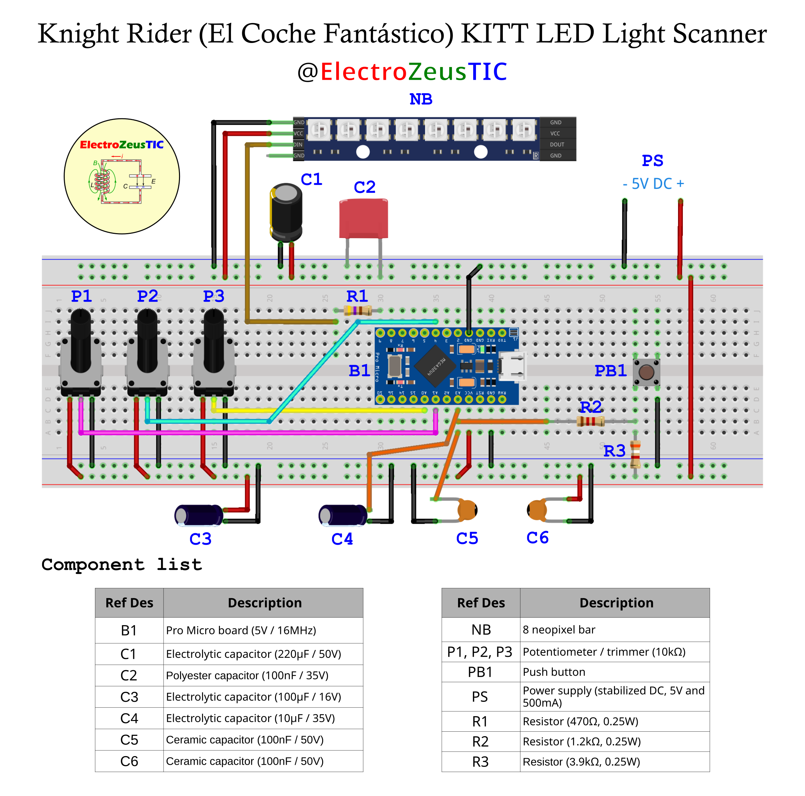

neopixels_light_scanner
=============================
Circuito y su programación para hacer el efecto de luces moviéndose de un lado para otro en una barra de 8 neopixels al estilo de el coche (KITT) de la serie El Coche Fantástico (Knight Rider).
Según el modo de funcionamiento, configurable mediante el código fuente antes de compilarlo, se puede usar: con la barra de neopixels (8 por defecto) solo o,
con la barra de neopixels más un botón que sirve para pausar/reanudar el movimiento de las luces con una pulsación corta o encenderlas haciendo un
fade-in o apagarlas haciendo un fade-out, esto con una pulsación larga. O con la barra de neopixels, más el botón y 3 potenciómetros que controlan la
velocidad del movimiento de las luces, el tono del color (hue) y el brillo global de las mismas dentro de unos límites. Y el último modo de
funcionamiento, que es usando la barra de neopixels junto a estos 3 potenciómetros solamente.

## Esquema del montaje (hardware)
Aquí se pueden ver los componentes usados para el proyecto:

Se usa una board Pro Micro (microcontrolador Atmega32U4 a 5V y 16MHz) que es un clon chino de la Sparkfun Pro Micro, pero debería de funcionar con cualquiera,
otro Arduino por ejemplo, que sea compatible con las librerías utilizadas, que funcione a 5V y tenga memoria suficiente. Haciendo adaptaciones en el hardware
se podría usar con boards que se alimenten a 3.3V. Los pines del pulsador (digital) y de los potenciómetros (analógicos) se pueden cambiar en el código fuente.

## Código fuente (software)
Seleccionar la versión correspondiente según el entorno de programación que se vaya a utilizar.
Hace falta instalar en el entorno de programación que vayas a utilizar las siguientes librerías antes de compilar el código fuente. Si usas el IDE de
Arduino se instalan buscándolas en el Gestor de bibliotecas y dándole al botón de INSTALAR. En Visual Studio Code con PlatformIO se instalan automáticamente
al hacer el Build:

* [FastLED by Daniel Garcia](https://github.com/FastLED/FastLED)
* [FireTimer by PowerBroker2](https://github.com/PowerBroker2/FireTimer)

### Versión para el IDE de Arduino:
Seleccionar el Arduino Leonardo en el *menú Herramientas > Placa*, si se programa un Pro Micro:

[Código fuente para el IDE de Arduino](ArduinoIDE/)

### Versión para PlatformIO:
Para programar la board Pro Micro:

[Código fuente para PlatformIO](PlatformIO/)

## Licencia
Mirar el archivo [LICENSE.md](./LICENSE.md)

## Renuncia de responsabilidad
Yo, electrozeustic (@ElectroZeusTIC) no me hago resposable del uso que se le pueda dar al software y al hardware usado en este proyecto por parte
de otras personas, empresas, instituciones, etc. Se ofrece tal como es, para experimentar y probar. Puede tener errores y por lo tanto, no usar en
entornos y situaciones críticas, ya que se puedan producir ciertos peligros con graves consecuencias. Las personas, empresas, entidades, etc que lo
usen serán los únicos responsables de las consecuencias que puedan ocurrir.
